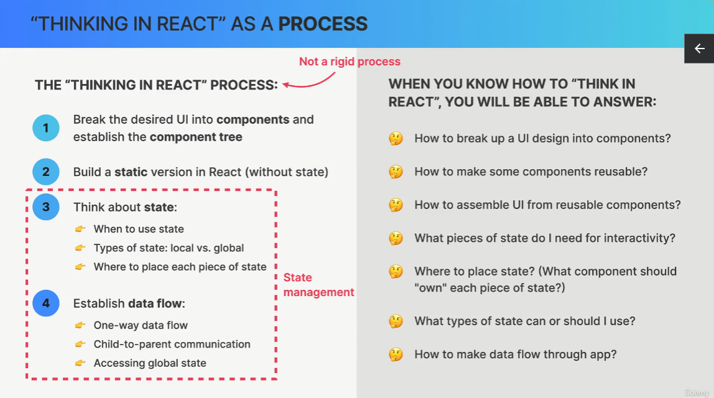
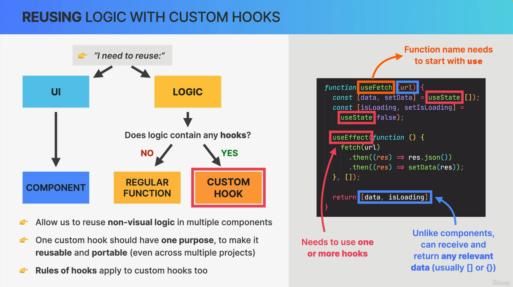

### Components, Instances and Elements


### How Rendering Works


#### 1. Overview

**How Renders Are Triggered**


**Virtual DOM**


* Rendering a component will cause all of its child components to be rendered as well (in Virtual DOM)

##### State Update Batching

* setState 的 state 更新并不是立即执行的，同一位置的多个 setState 只产生一个 component re-render

  * Render Phase 中，state 的更新会存在 Fiber Tree 中，此时重绘并未发生，state 仍是原来的值
  * 如果需要基于上一次更新的值再次更新 state，可以在 setState 的 callback function 中获取上一次更新后的值

  ```jsx
  setTitle((title) => title + 'Hello')
  ```

* React17 及以前在 timeout, promise, DOM 原生事件中调用 setState 并不会自动 batching，即每个 set 操作触发一次 render


#### 2. The Render Phase

##### Overview


##### Reconciliation 协调算法


##### Fiber


##### Diffing

* 情况一：相同位置，不同组件类型(component type)
  * 旧的组件及其子组件全部移除(即使子组件没有变化)，包括 state


* 情况二：相同位置，组件类型(component type)不变，但是组件中的属性变化
  * 当前组件及 state 保留，并向其传入新的 props 或 属性
  * 如果希望创建新的组件及 state，需要通过更改 **key prop** 的值


##### Key Prop


##### Side Effect And Pure Function

* side effect 不能发生在 render logic，但是可以通过 event handler 或者 effects (useEffect) 触发


##### Rules For Render Logic

* 不要在 Render logic 中更新 state，因为会导致 re-render 的发生再次触发更新 state 操作，造成死循环


#### 3. The Commit Phase

* commit phase 是 **同步 (synchronous)** 的


* React 不渲染 DOM，只是负责生成需要渲染更新的 DOM List
* 通过 Renderers (ReactDOM等)，向对应平台**提交 (commit)** Render Phase 的结果


#### 4. Summary


### How Effect Works

#### Event Delegation

* 事件委派：父组件中绑定事件监听，并通过 e.target 确定触发事件的子组件（利用事件冒泡阶段会触发父子组件中的相同事件的特性）


#### React Handles Events

* React 将所有事件 handler 注册在 root DOM 中 (`#root`)，相当于事件委托
* 注意：React 的事件委派描述的是 **DOM Tree** 而不是 Component Tree，**Component Tree 中的子组件不一定是 DOM Tree 中的子元素**


### React Libraries


### React Frameworks

* Next.js, Remix, Gatsby


### Effects

#### Component Instance Lifecycle


#### Event Handlers VS. Effects

**Event Handler**

* 创建 side effect 的推荐方法

**Effect**

* 在 component mount 后 (inital render) 和 re-render 之后 (基于依赖数组)
* useEffect 可以返回一个 cleanup 函数，在 effect 重新执行之前， unmounted 之后立刻执行

```jsx
useEffect(function() {
    // 执行代码
    
    return Cleanup函数
}, 依赖数组)
```


#### UseEffect Dependency Array


* effect 的同步与当前 useEffect 在 component instance 生命周期中触发阶段的关系


* UseEffect Dependency Array Rules


#### When Are Effects Executed


#### The Cleanup Function

* 在 effect 重新执行之前执行
* 在 component unmounted 之后执行


### React Hooks

React hooks are special built-in functions that allow to **hook into React internals**

* Creating and accessing **state** from Fiber tree
* Registering **side effects** in Fiber tree
* Manual **DOM selections**
* ...

#### Rules of Hooks


#### useState Summary

* 更新 object 或 array 类型的 state 时，采用直接替换的方法，确保 set 方法为纯函数


#### State VS. REFS

* refs 的更新不会触发 re-render
* refs 是可变更的
* refs 的更新是同步的


#### Logic With Custom Hook

* function 名称需要以 use 开头
* 内部需要至少使用一个 React Hook




### useReducer


#### useState vs. useReducer


### Styling Options in React


### State Management Options in React


#### context example

```jsx
import { createContext, useContext, useState } from 'react';

const DetailContext = createContext();

function DetailProvider({ children }) {
    const [param1, setParam1] = useState('')
    
    function fn() { console.log('Hello World') }
    
    return (
    	<DetailContext.Provider value={{param1, fn}}>
            { children }
        </DetailContext.Provider>
    )
}

function useDetail() {
    const context = useContext(DetailContext)
    if (!context) throw new Error("DetailContext was used outside DetailProvider")
    return context
}

export { DetailProvider, useDetail }
```


### Performance Optimization

#### memo


#### useMemo and useCallback

useMemo: memorize the result

useCallback: memorize the function


### Redux

redux middleware


### Context API VS. Redux


#### When to use


### React Query

